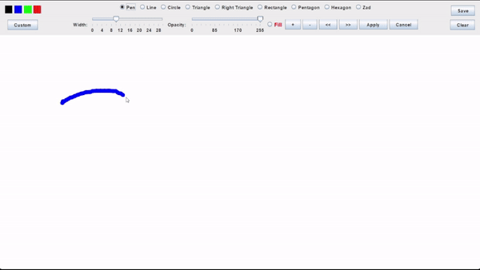
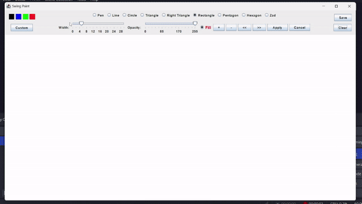
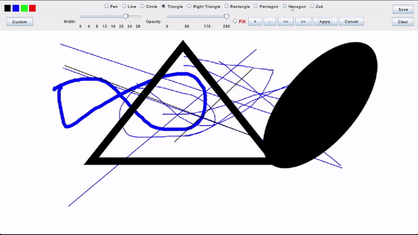
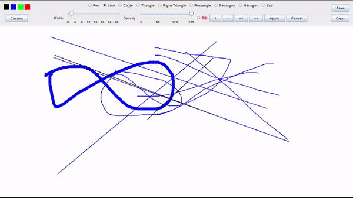

# Drawing App  

Drawing App is a basic drawing application developed in Java using Java AWT and Java Swing. It provides a simple and low-level interface for users to create drawings, making it a beginner-friendly tool.  

## Features  

Drawing Tools: Drawing App offers essential drawing tools such as pencil, line, rectangle, and ellipse for creating basic shapes and freehand drawings.  

Shape Manipulation: User can rotate, resize, and drag shapes before permanently pasting them onto the drawing board, allowing for more precise and customized designs.  

Line Width and Opacity Control: Customize the width of lines for different strokes and control the opacity of shapes and drawings for added artistic flexibility.  

Color Selection: User can choose from a variety of colors to customize their drawings.  

Save: Drawings can be saved as image files.  

## Technologies Used  

Java: The core programming language used for the application.  

Java AWT: Used for creating the basic graphical user interface.  

Java Swing: Utilized for implementing advanced GUI components and event handling.  

## Demo

|  |  |
| --- | --- |
|  |  |
